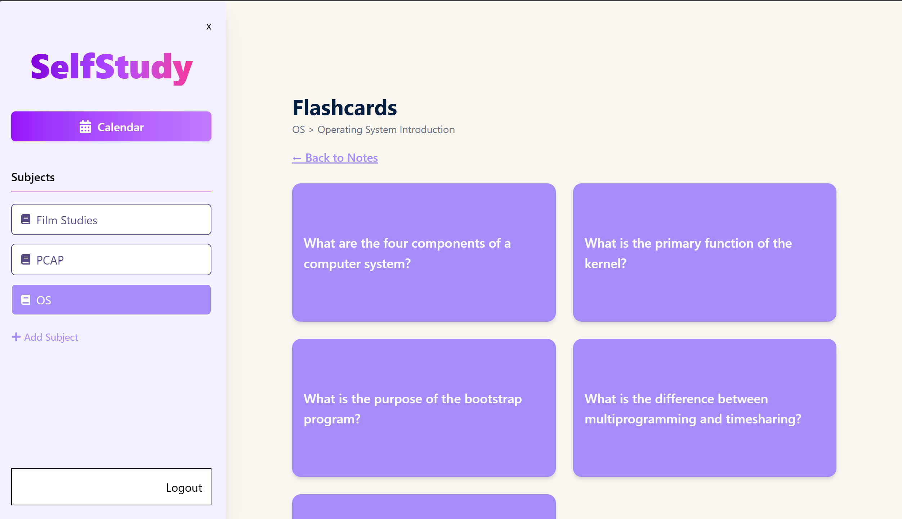
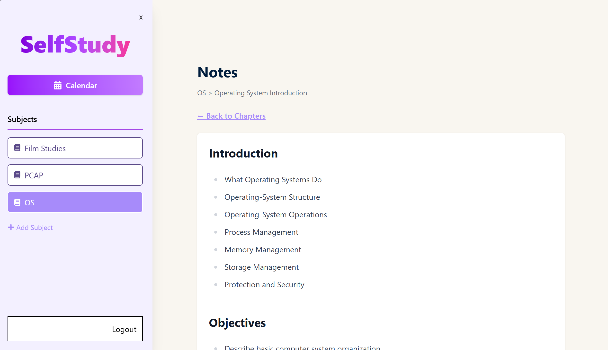
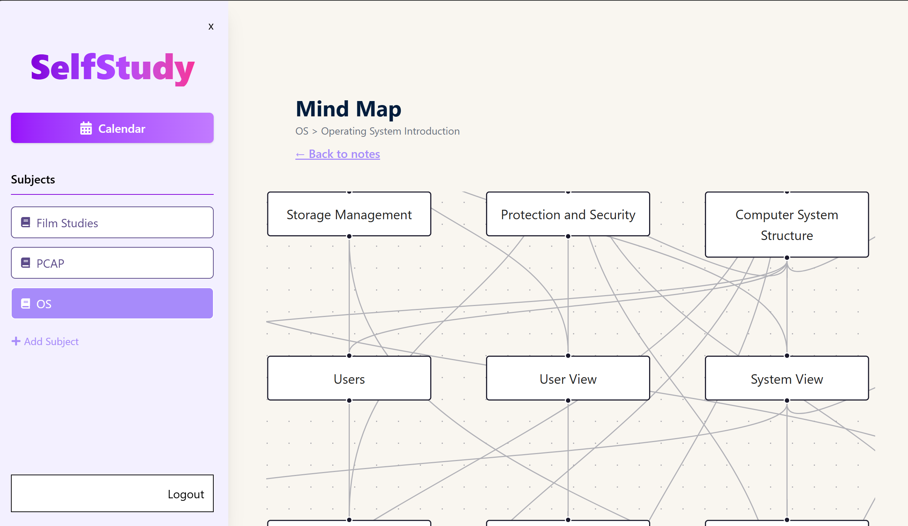
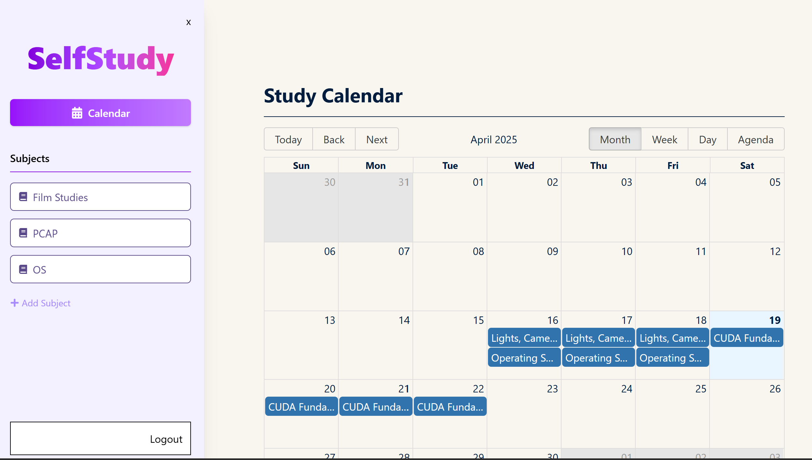

# SelfStudy AI

**SelfStudy AI** is an intelligent learning companion that turns your study PDFs into structured notes, flashcards, mind maps, and personalized revision schedules using AI. It's designed to help students streamline their self-study process and retain information more effectively.

## 🚀 Features

- 📄 **Smart PDF Parsing** – Upload a PDF and automatically extract chapters and headings.
- 🧠 **AI-Generated Notes & Flashcards** – Get concise summaries and flashcards powered by the Gemini API.
- 🗺️ **Interactive Mind Maps** – Visualize concepts and their relationships using dynamic D3-based mind maps.
- 📆 **Repetition Calendar** – Plan revisions using spaced repetition principles and track progress.

---

## 🛠️ Tech Stack

### Frontend

- **React** (with Vite)
- **Tailwind CSS**
- **React Big Calendar**
- **React Flow** (for mind map visualizations)

### Backend

- **Node.js + Express**
- **PostgreSQL** with **Prisma ORM**
- **Gemini API** for AI summarization and flashcard generation

### Other Tools

- **JWT Authentication**

---

### Screenshots

## 

## 

## 

## 
